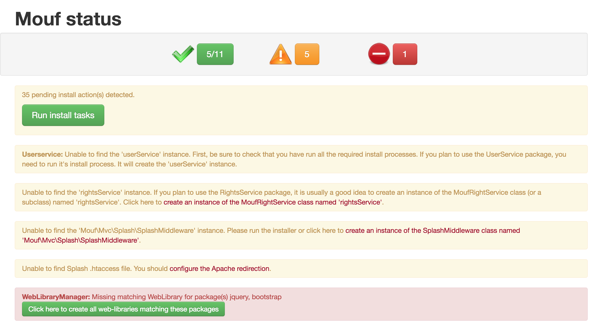
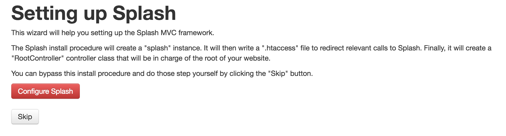
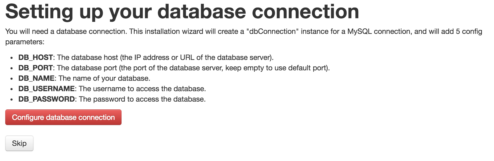
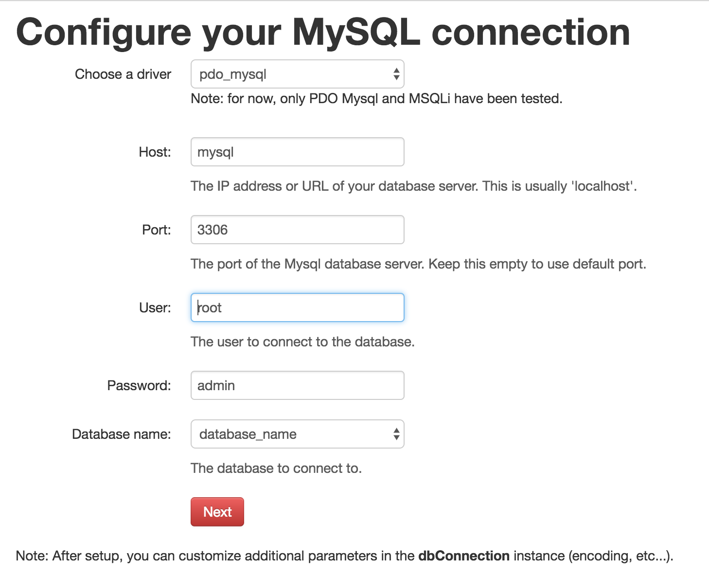
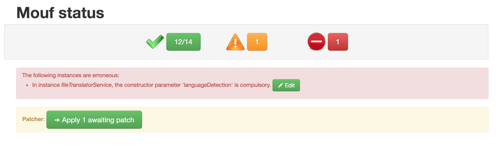

# Install Mouf framework

Simple tutorial to help you installing [Mouf framework](http://mouf-php.com/).

## Using TDBM ORM

First update your `composer.json` file located at `apache/volume`:

```
{
  "require": {
    "mouf/mouf": "~2.0.0",
    "mouf/mvc.splash": "~8.0",
    "mouf/database.tdbm": "~4.2",
    "mouf/database.patcher": "~2.1",
    "mouf/security.userservice-splash": "~8.0",
    "mouf/security.rightsservice-splash": "~8.0",
    "mouf/security.daos.tdbm": "~1.0",
    "oscarotero/psr7-middlewares": "~3.16",
    "mouf/security.simplelogincontroller": "^5.0",
    "monolog/monolog": "^1.21",
    "mouf/security.user-management-ui": "~1.0"
  },
  "autoload": {
    "psr-4": {
      "YourProject\\": "src/YourProject"
    }
  },
  "minimum-stability": "dev",
  "prefer-stable": true
}
```

Then run `make kickoff`.

Once everything has been installed and you're sure that your apache container is running (`make tail`), use `make composer cmd=install` in order to install PHP dependencies.

Good :smiley:? Now open your favorite web browser, copy / paste http://dev.yourproject.com/vendor/mouf/mouf/ and create the user you will use to connect to Mouf UI.

If you connect to Mouf UI, you should see the following:



Click on the button `Run install tasks` and then on the button `Run the x pending install tasks`.

---

After a while, it will ask you to set up Splash:



Click on the button `Configure Splash` and then on the button `Install Splash`.

---

Soon after, it will also ask you to set up your database connection:



Fill the form like the following (you might have to change some values):



---

Last but not least, it will ask you to set up TDBM:


Click on the button `Configure TDBM` and then on the button `Install TDBM`.

---

Once all tasks have been installed, navigate to the home of Mouf UI. You should see the following:



Click on the `Edit` button and of the erroneous instance *fileTranslatorService* and inject an instance of `LanguageDetectionInterface` (for example `cascadingLanguageDetection`).

You have now a fresh install of Mouf running in your docker container! :metal:

**Note:** if the message `A problem occured with your Mouf installation` appears, click on the URL specified in `Port forwarding issues`. On the new page, change the local URL to http://localhost/vendor/mouf/mouf/

## Using Doctrine ORM

TODO