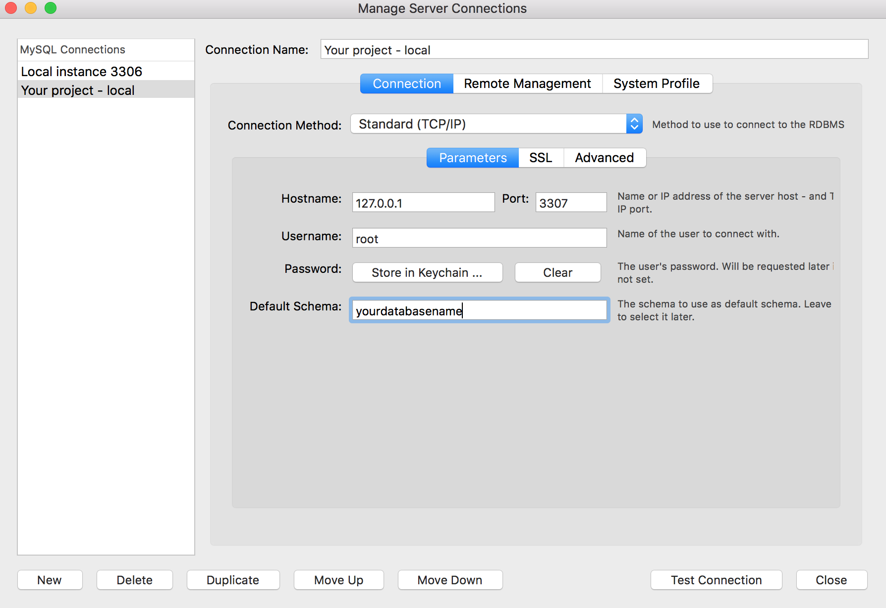

# Use MySQL Workbench to manage your database

Download and install the last version of MySQL Workbench following the official instructions: https://www.mysql.fr/products/workbench/

Run `make kickoff` and open MySQL Workbench: click on the `+` button next to `MySQL Connections` to setup a new connection:

Once done, click on `Test Connection` to check if your setup is correct. If so, click on `Ok` to save your setup.