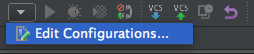
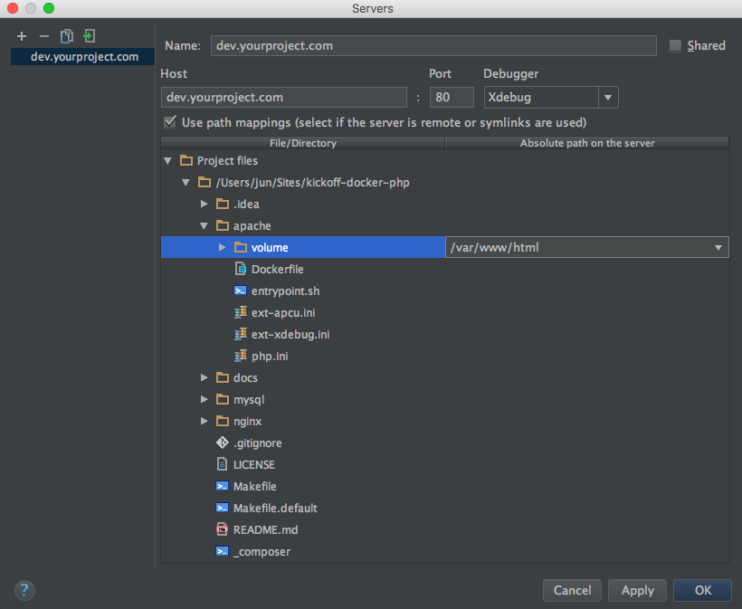
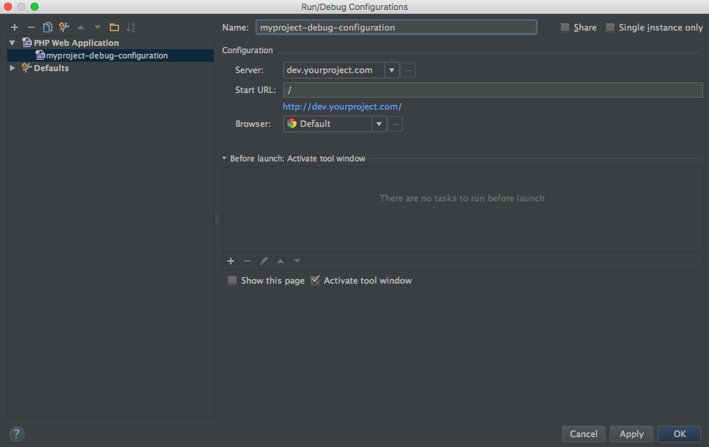

# Use Xdebug with PhpStorm

Add a new Run/Debug configuration (should be accessible on the top right of the screen):

Create a new `PHP Web Application` configuration and add a new server configuration:

**Important:** check `Using path mappings` and map the `apache/volume` folder with `/var/www/html`.

Last but not least, fill the form of the Run/Debug configuration:

